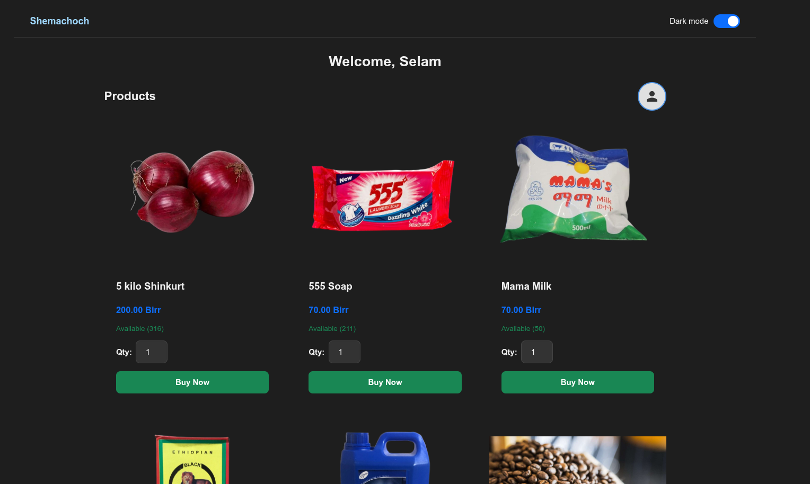

## 📸 Screenshots

Below are the screenshots of the system in order of the user flow:

### 1. Landing Page

The initial entry point for all users.


### 2. Authentication

#### Admin Login


#### Customer Login


### 3. Admin Panel

#### Admin Dashboard


#### Manage Goods


#### Reservations


#### Reports


### 4. Customer Portal

#### Product View



#### Customer Dashboard


#### Customer Dashboard (Light Mode)


---

## 🛠️ Installation & Setup

1. **Clone the repository:**

   ```bash
   git clone https://github.com/surafel9/shemachoch-reservation-system.git
   ```

2. **Database Setup:**
   - Open XAMPP/WAMP and start **Apache** and **MySQL**.
   - Go to `phpMyAdmin`.
   - Create a new database named `shemachochNew_db`.
   - Import the `shemachochNew_db.sql` file provided in the root directory.

3. **Configuration:**
   - Ensure the database credentials in `ShemachochAdminPanel/db_connect.php` match your local environment.

4. **Run the Application:**
   - Move the project folder to your `htdocs` directory.
   - Access the Customer Portal: `http://localhost/Shemachoch/CustomerPortal/index.php`
   - Access the Admin Panel: `http://localhost/Shemachoch/ShemachochAdminPanel/index.php`

---

## 📂 Project Structure

- `CustomerPortal/`: Frontend for customers to browse and reserve goods.
- `ShemachochAdminPanel/`: Backend management system for admins.
- `uploads/`: Directory for stored product images.
- `Screenshots/`: Visual documentation of the project.
