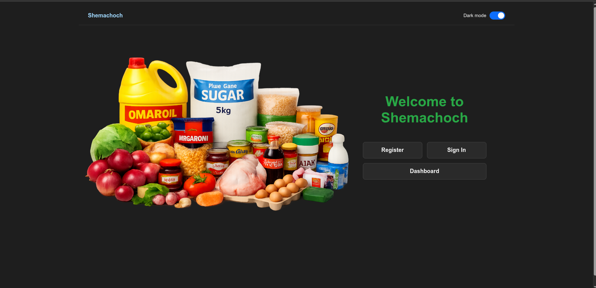
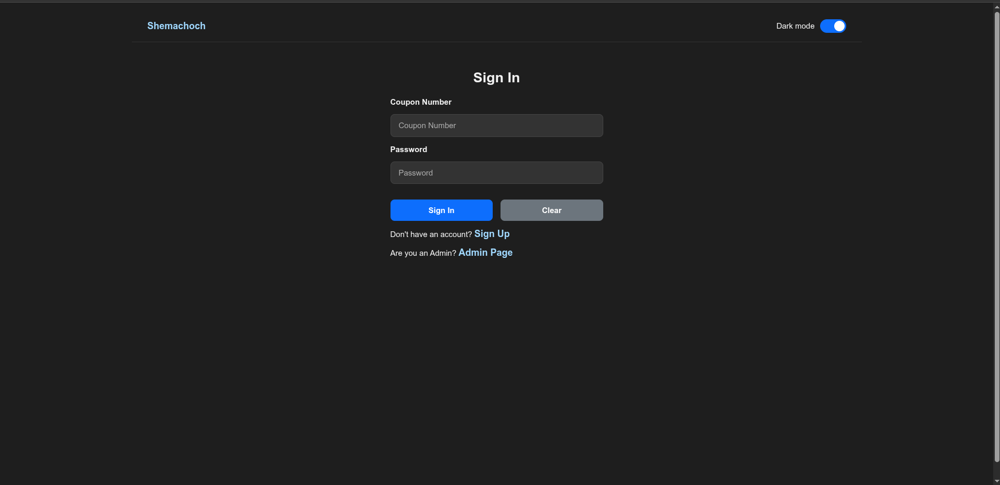
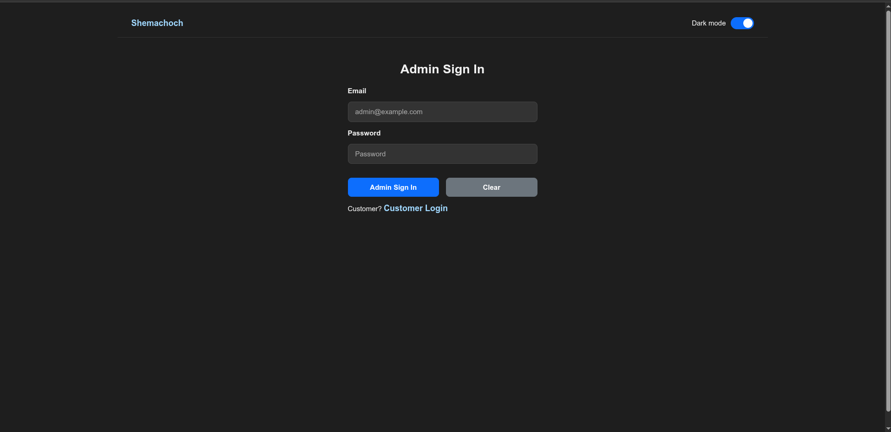
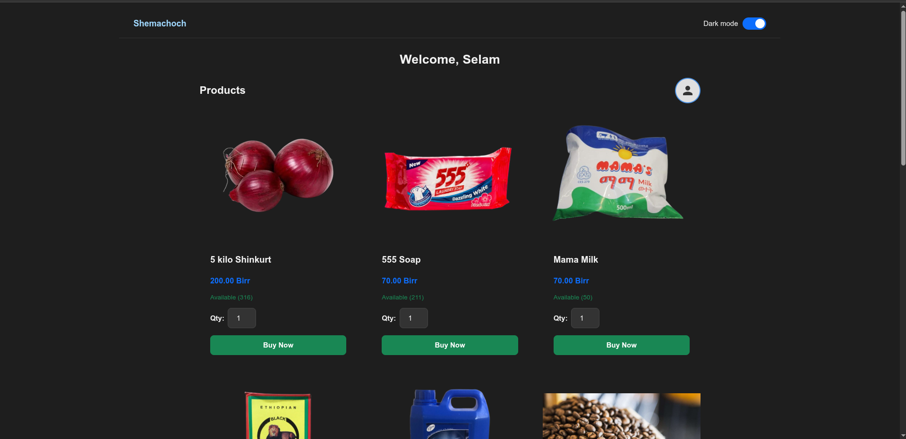
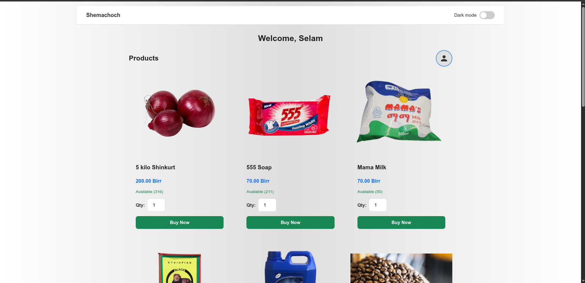
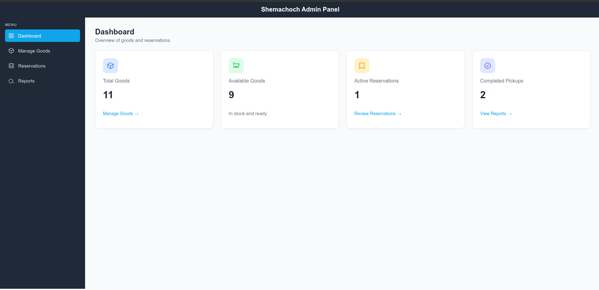
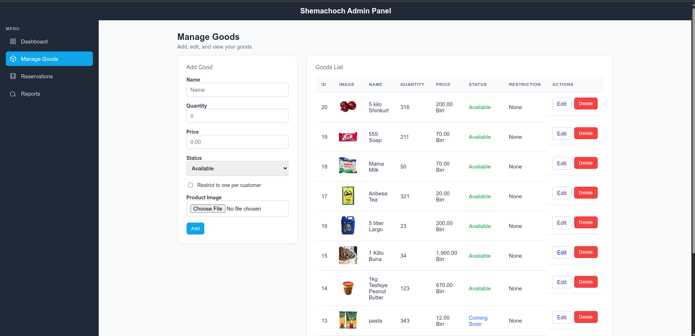
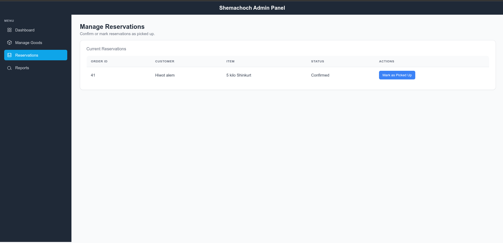
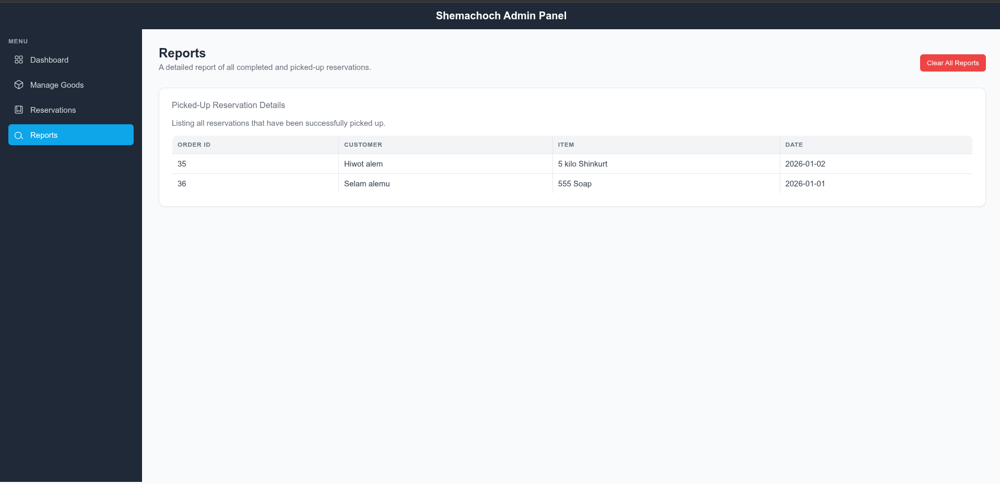

# Shemachoch Smart Reservation System

The Shemachoch Smart Reservation System is a simple and user-friendly web platform designed to solve the common problem of long customer queues and lack of product awareness. It allows customers to easily check item availability and reserve goods online without visiting the store physically.

With Admin and Customer roles, the system is built using PHP and MySQL. It features secure login, quick reservations, and flexible delivery or pickup options. Now customers can book items in advance and avoid unnecessary waiting.

## 📸 Screenshots

Below are the screenshots of the system in order of the user flow:

### 1. Landing Page

The initial entry point for all users.

### 2. Authentication

#### Customer Login

#### Admin Login

### 3. Customer Portal

#### Customer Dashboard

#### Customer Dashboard (Light Mode)

---

### 4. Admin Panel

#### Admin Dashboard

#### Manage Goods

#### Reservations

#### Reports

